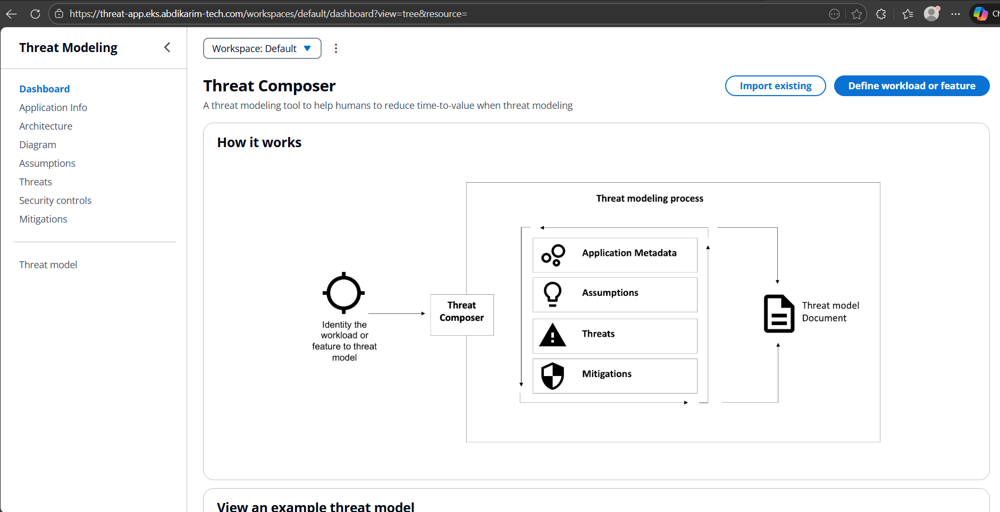
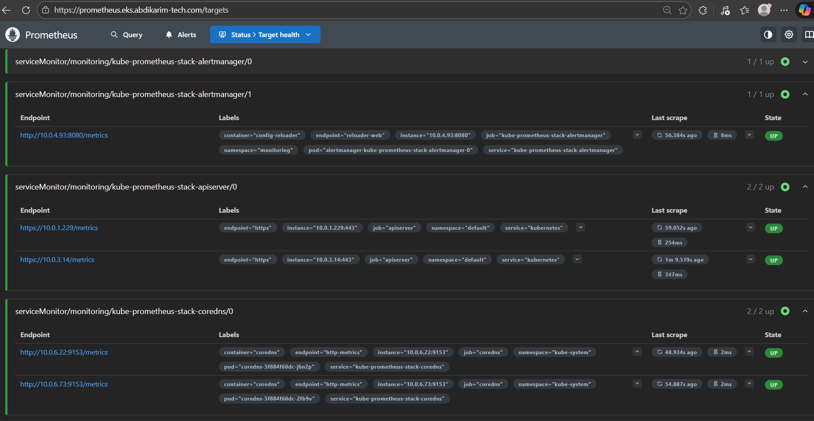
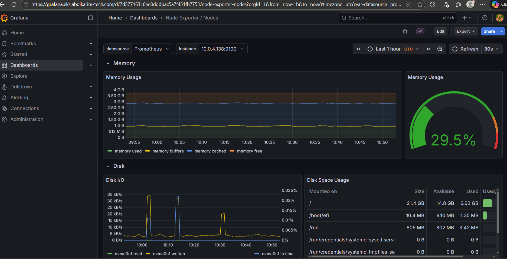
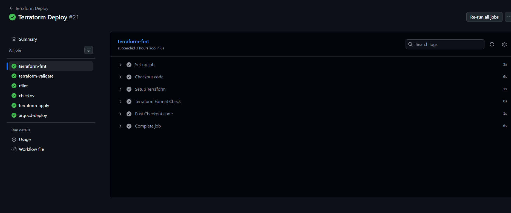

# EKS Cluster Deployment with ArgoCD, Helm Charts, Cert-Manager, and ExternalDNS

## Overview

This is a production-grade EKS (Elastic Kubernetes Service) deployment on AWS that integrates ArgoCD, Helm Charts, Cert-Manager, and ExternalDNS. The infrastructure implements GitOps workflows for automated deployments, Let's Encrypt for certificate management, and Route 53 integration for DNS automation.

## Key Features

- **Amazon EKS**: Managed Kubernetes service for running containerised applications at scale with high availability, security, and seamless AWS integration.
- **ArgoCD**: Declarative GitOps continuous delivery tool for Kubernetes, enabling automatic application deployment from Git repositories.
- **Helm Charts**: Simplifies the deployment and management of complex Kubernetes applications using reusable, version-controlled charts.
- **Cert-Manager**: Automates the management and issuance of TLS/SSL certificates within Kubernetes, integrated with Let's Encrypt for automated renewals.
- **ExternalDNS**: Dynamically manages DNS records in AWS Route 53 based on Kubernetes resources, automating DNS record creation and updates.
- **Nginx Ingress Controller**: Routes external HTTP/HTTPS traffic to Kubernetes services.
- **Prometheus Stack**: Comprehensive monitoring solution with Prometheus and Grafana for metrics collection and visualisation.
- **IRSA (IAM Roles for Service Accounts)**: Secure AWS API access for Kubernetes pods without hardcoded credentials.
- **CI/CD Pipelines**: GitHub Actions workflows for infrastructure deployment and application builds with security scanning.

## Why This Setup Matters

- **GitOps with ArgoCD**: Ensures consistent, version-controlled deployments through automated Git synchronisation.
- **Scalable Infrastructure**: Utilises EKS for auto-scaling and high availability.
- **Secure Communication**: Implements TLS/SSL for encrypted traffic with Cert-Manager.
- **Automated DNS Management**: ExternalDNS reduces manual effort by automating DNS configurations.
- **Infrastructure as Code**: Everything is defined in Terraform for reproducibility and version control.

## Infrastructure Components

- **VPC (Virtual Private Cloud)**: Provides a secure, isolated network environment for the cluster with public and private subnets.
- **EKS (Elastic Kubernetes Service)**: Manages the Kubernetes control plane and worker nodes.
- **Nginx Ingress Controller**: Entry point for external traffic into the cluster.
- **ArgoCD**: Manages application deployments based on Git repositories.
- **Helm**: Deploys and manages Kubernetes resources using Helm charts.
- **Cert-Manager**: Handles SSL/TLS certificate issuance and renewal via Let's Encrypt.
- **ExternalDNS**: Automates DNS record updates in AWS Route 53.
- **Prometheus & Grafana**: Monitoring and visualisation of cluster metrics.
- **IAM Roles for Service Accounts (IRSA)**: Provides secure AWS credentials to Kubernetes pods.

## Project Structure

```
.
├── terraform/
│   ├── main.tf              # Main Terraform configuration
│   ├── eks.tf               # EKS cluster configuration
│   ├── vpc.tf               # VPC and networking setup
│   ├── irsa.tf              # IAM roles for service accounts
│   ├── helm.tf              # Helm chart deployments
│   ├── variables.tf         # Variable definitions
│   └── outputs.tf           # Output values
│
├── helm-values/
│   ├── nginx-ingress.yaml   # Nginx Ingress configuration
│   ├── cert-manager.yaml    # Cert-Manager configuration
│   ├── external-dns.yaml    # External DNS configuration
│   ├── argo-cd.yaml         # ArgoCD configuration
│   └── monitoring.yaml      # Prometheus stack configuration
│
├── cert-manager/
│   └── cluster-issuer.yaml  # Let's Encrypt certificate issuer
│
├── argocd/
│   └── application.yaml     # ArgoCD application definitions
│
└── .github/
    └── workflows/
        └── deploy-infra.yml # Infrastructure deployment workflow
```

## Prerequisites

- AWS Account with appropriate IAM permissions
- AWS CLI configured (`aws configure`)
- Terraform >= 1.0
- kubectl
- Helm >= 3.0
- Domain name configured in Route 53 (for DNS and SSL)

## Setup Instructions

### 1. Clone the Repository

```bash
git clone <repository-url>
cd <repository-directory>
```

### 2. Configure AWS & Variables

```bash
# Configure AWS CLI
aws configure

# Create terraform.tfvars in infra/ directory
cluster_name = "eks-prod"
region       = "eu-north-1"
domain_name  = "example.com"
```

### 3. Deploy Infrastructure

```bash
cd infra
terraform init
terraform plan
terraform apply
```

### 4. Configure kubectl

```bash
aws eks update-kubeconfig --region eu-north-1 --name eks-prod
kubectl get nodes
```

### 5. Apply Kubernetes Resources

```bash
kubectl apply -f cert-manager/cluster-issuer.yaml
kubectl apply -f argocd/application.yaml
```

### 6. Access ArgoCD

```bash
# Get admin password
kubectl -n argocd get secret argocd-initial-admin-secret \
  -o jsonpath="{.data.password}" | base64 -d

# Access at: https://argocd.<your-domain>
# Username: admin
```

## Clean-Up Resources

To destroy all infrastructure:

```bash
cd terraform
terraform destroy
```

**Warning**: This will permanently delete the EKS cluster and all associated AWS resources.

## Future Enhancements

- **Auto-Scaling**: Configure Horizontal Pod Autoscaler (HPA) and Cluster Autoscaler
- **Security Hardening**: Implement additional RBAC policies and Pod Security Standards
- **Logging**: Integrate centralised logging with AWS CloudWatch or ELK stack

## Visuals

### Application Interface

The deployed Threat Intelligence application running on the EKS cluster:



### Monitoring & Observability

Prometheus metrics collection and monitoring dashboard:



Grafana visualisation for cluster and application metrics:



### CI/CD Pipelines

Automated build workflow using GitHub Actions:


Automated deployment workflow for infrastructure and applications:



